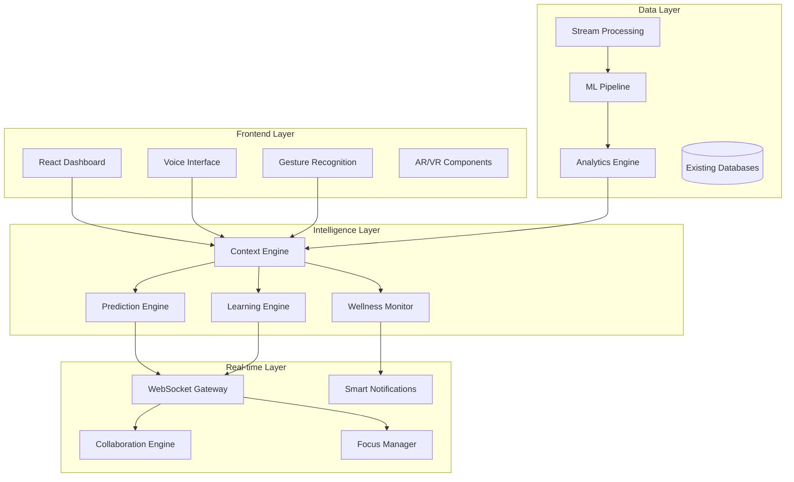
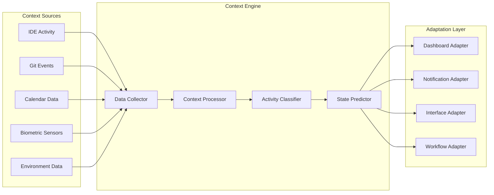

# Advanced User Experience Enhancements - Design Document

## Overview

This design document outlines the architecture and implementation approach for advanced user experience enhancements to the DevFlow Intelligence Platform. The design focuses on intelligent automation, predictive analytics, and seamless multi-modal interactions while maintaining the existing robust real-time data infrastructure.

## Architecture

### High-Level Architecture



### Context-Aware Intelligence Architecture



## Components and Interfaces

### 1. Context Engine

**Purpose:** Intelligently understand user's current work context and state

**Core Components:**
- **Activity Classifier:** ML model to classify current work activity (coding, reviewing, planning, debugging)
- **Context Aggregator:** Combines multiple data sources into unified context
- **State Predictor:** Predicts user's next likely actions and needs
- **Context History:** Maintains temporal context for pattern recognition

**Key Interfaces:**
```typescript
interface ContextEngine {
  getCurrentContext(): Promise<WorkContext>;
  subscribeToContextChanges(callback: (context: WorkContext) => void): void;
  predictNextActions(context: WorkContext): Promise<PredictedAction[]>;
  getContextHistory(timeRange: TimeRange): Promise<ContextEvent[]>;
}

interface WorkContext {
  activityType: 'coding' | 'reviewing' | 'planning' | 'debugging' | 'meeting';
  projectContext: ProjectInfo;
  focusLevel: number; // 0-100
  collaborationState: CollaborationInfo;
  environmentFactors: EnvironmentData;
  timestamp: Date;
  confidence: number;
}
```

### 2. Predictive Task Management System

**Purpose:** AI-powered task optimization and bottleneck prediction

**Core Components:**
- **Completion Predictor:** ML model for task completion time estimation
- **Bottleneck Detector:** Identifies potential workflow bottlenecks
- **Dependency Analyzer:** Analyzes and optimizes task dependencies
- **Workload Balancer:** Suggests optimal task distribution

**Key Interfaces:**
```typescript
interface PredictiveTaskManager {
  predictTaskCompletion(task: Task): Promise<CompletionPrediction>;
  detectBottlenecks(tasks: Task[]): Promise<Bottleneck[]>;
  optimizeTaskOrder(tasks: Task[]): Promise<OptimizedTaskList>;
  suggestWorkloadBalance(team: TeamMember[]): Promise<BalanceSuggestion[]>;
}

interface CompletionPrediction {
  estimatedHours: number;
  confidence: number;
  riskFactors: RiskFactor[];
  suggestedMilestones: Milestone[];
}
```

### 3. Multi-Modal Interaction System

**Purpose:** Seamless voice, gesture, and keyboard interaction

**Core Components:**
- **Voice Command Processor:** Natural language processing for voice commands
- **Gesture Recognition Engine:** Computer vision for gesture detection
- **Contextual Command Suggester:** Smart command recommendations
- **Interaction Mode Manager:** Switches between interaction modes

**Key Interfaces:**
```typescript
interface MultiModalInterface {
  processVoiceCommand(audio: AudioData): Promise<CommandResult>;
  recognizeGesture(video: VideoFrame): Promise<GestureResult>;
  suggestCommands(context: WorkContext): Promise<Command[]>;
  setInteractionMode(mode: InteractionMode): void;
}

interface Command {
  id: string;
  name: string;
  description: string;
  shortcuts: KeyboardShortcut[];
  voicePatterns: string[];
  gestures: GesturePattern[];
  contextRelevance: number;
}
```

### 4. AI-Enhanced Code Archaeology

**Purpose:** Intelligent insights for 3D code visualization

**Core Components:**
- **Code Evolution Analyzer:** Tracks and analyzes code changes over time
- **Architecture Insight Generator:** AI-powered architectural analysis
- **Collaboration Pattern Detector:** Identifies team collaboration patterns
- **Refactoring Opportunity Finder:** Suggests code improvements

**Key Interfaces:**
```typescript
interface EnhancedCodeArchaeology {
  generateArchitecturalInsights(codebase: CodebaseData): Promise<ArchitecturalInsight[]>;
  analyzeCollaborationPatterns(commits: GitCommit[]): Promise<CollaborationPattern[]>;
  findRefactoringOpportunities(code: CodeArtifact[]): Promise<RefactoringOpportunity[]>;
  predictMaintenanceHotspots(codebase: CodebaseData): Promise<MaintenanceHotspot[]>;
}

interface ArchitecturalInsight {
  type: 'coupling' | 'cohesion' | 'complexity' | 'pattern';
  description: string;
  impact: 'low' | 'medium' | 'high';
  recommendation: string;
  affectedFiles: string[];
  confidence: number;
}
```

### 5. Wellness and Productivity Monitor

**Purpose:** Proactive wellness monitoring and productivity optimization

**Core Components:**
- **Biometric Data Processor:** Analyzes health and wellness indicators
- **Productivity Pattern Analyzer:** Identifies optimal work patterns
- **Fatigue Detector:** Monitors signs of fatigue and burnout
- **Wellness Intervention Suggester:** Recommends wellness actions

**Key Interfaces:**
```typescript
interface WellnessMonitor {
  analyzeBiometricData(data: BiometricData): Promise<WellnessState>;
  detectFatigue(workingPatterns: WorkingPattern[]): Promise<FatigueLevel>;
  suggestBreaks(currentState: WellnessState): Promise<BreakSuggestion[]>;
  optimizeSchedule(preferences: UserPreferences): Promise<OptimalSchedule>;
}

interface WellnessState {
  stressLevel: number; // 0-100
  fatigueLevel: number; // 0-100
  focusCapacity: number; // 0-100
  recommendedActions: WellnessAction[];
  riskFactors: string[];
}
```

### 6. Real-Time Collaboration Engine

**Purpose:** Seamless distributed team collaboration

**Core Components:**
- **Presence Manager:** Tracks team member presence and activity
- **Conflict Resolution Engine:** Handles concurrent editing conflicts
- **Ambient Awareness System:** Provides subtle team activity indicators
- **Screen Sharing Coordinator:** Manages context-aware screen sharing

**Key Interfaces:**
```typescript
interface CollaborationEngine {
  trackPresence(userId: string): Promise<PresenceInfo>;
  shareContext(context: WorkContext, targetUsers: string[]): Promise<void>;
  resolveConflicts(conflicts: EditConflict[]): Promise<Resolution[]>;
  enableAmbientAwareness(teamId: string): Promise<AwarenessStream>;
}

interface PresenceInfo {
  userId: string;
  status: 'active' | 'idle' | 'busy' | 'away';
  currentActivity: string;
  availableForCollaboration: boolean;
  workingOn: ProjectInfo;
  lastSeen: Date;
}
```

### 7. Intelligent Notification System

**Purpose:** Context-aware, non-disruptive notifications

**Core Components:**
- **Context-Aware Scheduler:** Schedules notifications based on user state
- **Priority Engine:** Determines notification urgency and importance
- **Delivery Mode Selector:** Chooses optimal notification delivery method
- **Notification Batcher:** Groups related notifications intelligently

**Key Interfaces:**
```typescript
interface SmartNotificationSystem {
  scheduleNotification(notification: Notification, context: WorkContext): Promise<void>;
  batchNotifications(notifications: Notification[]): Promise<NotificationBatch[]>;
  selectDeliveryMode(notification: Notification, userState: UserState): Promise<DeliveryMode>;
  deferNotifications(criteria: DeferCriteria): Promise<void>;
}

interface Notification {
  id: string;
  type: NotificationType;
  priority: 'low' | 'medium' | 'high' | 'urgent';
  content: NotificationContent;
  contextRequirements: ContextRequirement[];
  deliveryModes: DeliveryMode[];
  expiresAt?: Date;
}
```

### 8. Adaptive Learning System

**Purpose:** Continuous improvement through user behavior analysis

**Core Components:**
- **Behavior Pattern Analyzer:** Identifies user behavior patterns
- **Preference Learning Engine:** Learns and adapts to user preferences
- **Interface Optimizer:** Optimizes interface based on usage patterns
- **Recommendation Engine:** Provides personalized recommendations

**Key Interfaces:**
```typescript
interface AdaptiveLearningSystem {
  analyzeUserBehavior(interactions: UserInteraction[]): Promise<BehaviorPattern[]>;
  updatePreferences(userId: string, patterns: BehaviorPattern[]): Promise<void>;
  optimizeInterface(userId: string): Promise<InterfaceOptimization[]>;
  generateRecommendations(context: WorkContext): Promise<Recommendation[]>;
}

interface BehaviorPattern {
  patternType: string;
  frequency: number;
  context: WorkContext[];
  confidence: number;
  trend: 'increasing' | 'decreasing' | 'stable';
}
```

## Data Models

### Core Data Structures

```typescript
// Enhanced User Context
interface EnhancedUserContext {
  userId: string;
  currentActivity: ActivityType;
  focusState: FocusState;
  workingMemory: WorkingMemoryItem[];
  preferences: AdaptivePreferences;
  wellnessState: WellnessState;
  collaborationContext: CollaborationContext;
  environmentContext: EnvironmentContext;
}

// Predictive Models
interface PredictionModel {
  modelId: string;
  modelType: 'completion_time' | 'bottleneck' | 'wellness' | 'context';
  accuracy: number;
  lastTrained: Date;
  features: ModelFeature[];
  hyperparameters: Record<string, any>;
}

// Multi-Modal Commands
interface MultiModalCommand {
  commandId: string;
  name: string;
  voicePatterns: VoicePattern[];
  gesturePatterns: GesturePattern[];
  keyboardShortcuts: KeyboardShortcut[];
  contextFilters: ContextFilter[];
  executionHandler: string;
}
```

## Error Handling

### Graceful Degradation Strategy

1. **AI Service Failures:**
   - Fall back to rule-based systems when ML models are unavailable
   - Cache predictions to serve stale but useful data
   - Provide manual override options for all AI-driven features

2. **Context Detection Failures:**
   - Use last known good context with confidence indicators
   - Allow manual context setting as fallback
   - Gracefully handle missing or incomplete context data

3. **Real-time Collaboration Issues:**
   - Implement conflict-free replicated data types (CRDTs)
   - Provide offline mode with sync when connection restored
   - Show clear indicators of collaboration state

4. **Multi-Modal Interface Failures:**
   - Always maintain keyboard/mouse fallback
   - Provide clear feedback when voice/gesture recognition fails
   - Allow users to disable problematic interaction modes

## Testing Strategy

### Testing Approach

1. **AI Model Testing:**
   - A/B testing for prediction accuracy
   - Continuous model performance monitoring
   - User feedback integration for model improvement

2. **Context Awareness Testing:**
   - Simulated work scenarios for context detection
   - Edge case testing for context transitions
   - Privacy-preserving testing with synthetic data

3. **Multi-Modal Interface Testing:**
   - Cross-platform compatibility testing
   - Accessibility testing for different interaction modes
   - Performance testing for real-time gesture/voice processing

4. **Collaboration Testing:**
   - Concurrent user simulation
   - Network partition testing
   - Conflict resolution scenario testing

5. **Wellness Monitoring Testing:**
   - Ethical testing with user consent
   - Accuracy validation against established wellness metrics
   - Privacy and data security testing

## Security and Privacy Considerations

### Privacy-First Design

1. **Data Minimization:**
   - Collect only necessary biometric and behavioral data
   - Implement data retention policies with automatic cleanup
   - Provide granular privacy controls for users

2. **Local Processing:**
   - Process sensitive data locally when possible
   - Use federated learning for model training
   - Implement differential privacy for aggregated insights

3. **Consent Management:**
   - Explicit consent for biometric data collection
   - Granular permissions for different data types
   - Easy opt-out mechanisms for all monitoring features

4. **Security Measures:**
   - End-to-end encryption for collaboration data
   - Secure multi-party computation for team analytics
   - Regular security audits for AI model integrity

## Performance Considerations

### Optimization Strategies

1. **Real-time Processing:**
   - Edge computing for low-latency context detection
   - Efficient streaming algorithms for continuous data processing
   - Caching strategies for frequently accessed predictions

2. **Scalability:**
   - Microservices architecture for independent scaling
   - Load balancing for AI inference services
   - Database sharding for user context data

3. **Resource Management:**
   - Adaptive quality settings based on device capabilities
   - Background processing for non-critical AI tasks
   - Memory-efficient data structures for real-time collaboration

4. **Network Optimization:**
   - Delta synchronization for collaboration updates
   - Compression for voice and gesture data transmission
   - Offline-first design with intelligent sync strategies