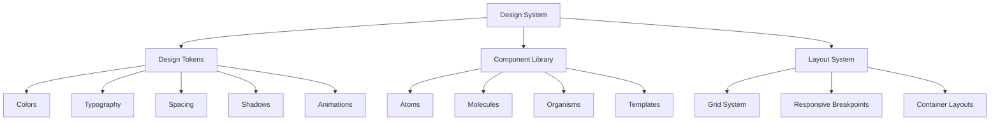
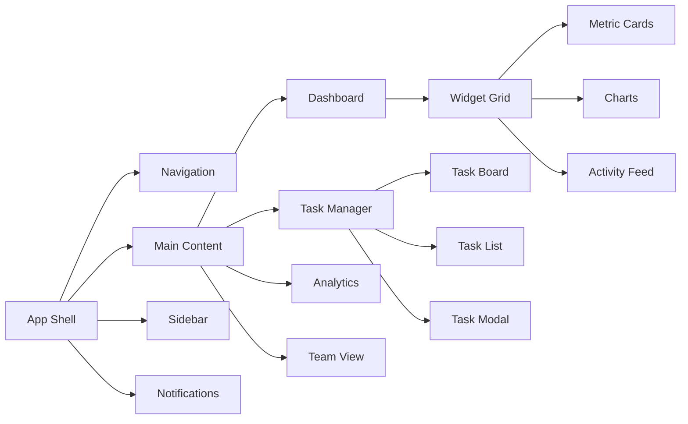
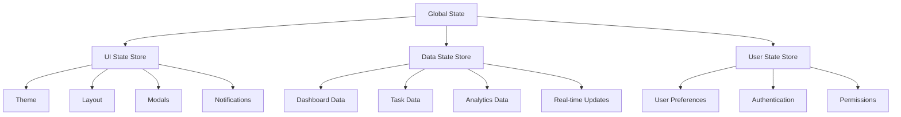

# Design Document

## Overview

This design outlines a comprehensive, production-ready UI system for the DevFlow Intelligence Dashboard that transforms the current basic interface into a modern, professional, and highly functional developer productivity platform. The design emphasizes dark theme aesthetics, smooth animations, real-time data visualization, and enterprise-grade user experience patterns.

The system will be built using React with TypeScript, leveraging modern libraries for charts (Recharts/Chart.js), animations (Framer Motion), and state management (Zustand). The design follows atomic design principles with a comprehensive design system that ensures consistency across all components.

## Architecture

### Design System Foundation



### Component Architecture



### State Management Architecture



## Components and Interfaces

### Core Design System Components

#### 1. Design Tokens
```typescript
// Design tokens for consistent theming
export const designTokens = {
  colors: {
    primary: {
      50: '#eff6ff',
      500: '#3b82f6',
      600: '#2563eb',
      900: '#1e3a8a'
    },
    dark: {
      50: '#f8fafc',
      100: '#f1f5f9',
      800: '#1e293b',
      900: '#0f172a',
      950: '#020617'
    },
    success: '#10b981',
    warning: '#f59e0b',
    error: '#ef4444',
    info: '#06b6d4'
  },
  typography: {
    fontFamily: {
      sans: ['Inter', 'system-ui', 'sans-serif'],
      mono: ['JetBrains Mono', 'monospace']
    },
    fontSize: {
      xs: '0.75rem',
      sm: '0.875rem',
      base: '1rem',
      lg: '1.125rem',
      xl: '1.25rem',
      '2xl': '1.5rem',
      '3xl': '1.875rem'
    }
  },
  spacing: {
    xs: '0.25rem',
    sm: '0.5rem',
    md: '1rem',
    lg: '1.5rem',
    xl: '2rem',
    '2xl': '3rem'
  },
  borderRadius: {
    sm: '0.25rem',
    md: '0.375rem',
    lg: '0.5rem',
    xl: '0.75rem'
  },
  shadows: {
    sm: '0 1px 2px 0 rgb(0 0 0 / 0.05)',
    md: '0 4px 6px -1px rgb(0 0 0 / 0.1)',
    lg: '0 10px 15px -3px rgb(0 0 0 / 0.1)',
    xl: '0 20px 25px -5px rgb(0 0 0 / 0.1)'
  }
};
```

#### 2. Base Components

**Button Component**
```typescript
interface ButtonProps {
  variant: 'primary' | 'secondary' | 'ghost' | 'danger';
  size: 'sm' | 'md' | 'lg';
  loading?: boolean;
  disabled?: boolean;
  icon?: React.ReactNode;
  children: React.ReactNode;
  onClick?: () => void;
}

// Features: Loading states, icon support, multiple variants, accessibility
```

**Card Component**
```typescript
interface CardProps {
  variant: 'default' | 'elevated' | 'outlined' | 'glass';
  padding: 'none' | 'sm' | 'md' | 'lg';
  hover?: boolean;
  interactive?: boolean;
  children: React.ReactNode;
}

// Features: Glass morphism effects, hover animations, interactive states
```

**Input Component**
```typescript
interface InputProps {
  type: 'text' | 'email' | 'password' | 'search' | 'number';
  size: 'sm' | 'md' | 'lg';
  state: 'default' | 'error' | 'success' | 'loading';
  icon?: React.ReactNode;
  placeholder?: string;
  label?: string;
  helperText?: string;
  errorText?: string;
}

// Features: Floating labels, validation states, icon support, auto-complete
```

### Dashboard Components

#### 1. Modern Dashboard Layout
```typescript
interface DashboardLayoutProps {
  sidebar: React.ReactNode;
  header: React.ReactNode;
  main: React.ReactNode;
  notifications?: React.ReactNode;
  theme: 'light' | 'dark' | 'auto';
}

// Features:
// - Collapsible sidebar with smooth animations
// - Sticky header with blur backdrop
// - Responsive grid system
// - Theme switching with smooth transitions
```

#### 2. Advanced Widget System
```typescript
interface WidgetProps {
  id: string;
  title: string;
  type: 'metric' | 'chart' | 'table' | 'activity' | 'custom';
  size: { width: number; height: number };
  position: { x: number; y: number };
  data: any;
  config: WidgetConfig;
  editable?: boolean;
  resizable?: boolean;
  draggable?: boolean;
}

// Features:
// - Drag and drop repositioning
// - Resize handles with constraints
// - Real-time data updates
// - Loading and error states
// - Export capabilities
```

#### 3. Interactive Chart Components
```typescript
interface ChartProps {
  type: 'line' | 'bar' | 'pie' | 'area' | 'scatter' | 'heatmap';
  data: ChartData;
  config: ChartConfig;
  interactive?: boolean;
  realTime?: boolean;
  exportable?: boolean;
  zoomable?: boolean;
}

// Features:
// - Smooth animations and transitions
// - Interactive tooltips and legends
// - Zoom and pan capabilities
// - Real-time data streaming
// - Multiple export formats
// - Accessibility support
```

### Task Management Components

#### 1. Advanced Task Board
```typescript
interface TaskBoardProps {
  columns: TaskColumn[];
  tasks: Task[];
  onTaskMove: (taskId: string, columnId: string) => void;
  onTaskUpdate: (task: Task) => void;
  dragEnabled?: boolean;
  virtualScrolling?: boolean;
  groupBy?: 'assignee' | 'priority' | 'tag';
}

// Features:
// - Smooth drag and drop with visual feedback
// - Virtual scrolling for large datasets
// - Grouping and filtering options
// - Bulk operations
// - Keyboard navigation
```

#### 2. Enhanced Task Modal
```typescript
interface TaskModalProps {
  task?: Task;
  mode: 'create' | 'edit' | 'view';
  onSave: (task: Task) => void;
  onDelete?: (taskId: string) => void;
  autoSave?: boolean;
  collaborative?: boolean;
}

// Features:
// - Auto-save functionality
// - Rich text editor for descriptions
// - File attachments
// - Comment system
// - Activity timeline
// - Collaborative editing indicators
```

### Navigation and Layout

#### 1. Intelligent Navigation
```typescript
interface NavigationProps {
  items: NavigationItem[];
  collapsed?: boolean;
  theme: 'light' | 'dark';
  user: User;
  notifications: Notification[];
}

// Features:
// - Breadcrumb navigation
// - Search functionality
// - Notification badges
// - User profile dropdown
// - Quick actions menu
// - Keyboard shortcuts
```

#### 2. Responsive Layout System
```typescript
interface LayoutSystemProps {
  breakpoints: Breakpoints;
  columns: number;
  gap: string;
  children: React.ReactNode;
}

// Features:
// - CSS Grid based layout
// - Responsive breakpoints
// - Auto-fit and auto-fill options
// - Aspect ratio maintenance
// - Container queries support
```

## Data Models

### UI State Models
```typescript
interface UIState {
  theme: 'light' | 'dark' | 'auto';
  sidebarCollapsed: boolean;
  activeModal: string | null;
  notifications: Notification[];
  loading: LoadingState;
  errors: ErrorState;
}

interface LoadingState {
  global: boolean;
  components: Record<string, boolean>;
}

interface ErrorState {
  global: Error | null;
  components: Record<string, Error | null>;
}
```

### Dashboard Models
```typescript
interface Dashboard {
  id: string;
  name: string;
  layout: LayoutConfig;
  widgets: Widget[];
  filters: FilterConfig;
  permissions: Permission[];
  theme: ThemeConfig;
}

interface Widget {
  id: string;
  type: WidgetType;
  title: string;
  position: Position;
  size: Size;
  data: WidgetData;
  config: WidgetConfig;
  permissions: Permission[];
}

interface WidgetData {
  source: DataSource;
  query: QueryConfig;
  cache: CacheConfig;
  realTime: boolean;
}
```

### Task Models
```typescript
interface Task {
  id: string;
  title: string;
  description: string;
  status: TaskStatus;
  priority: TaskPriority;
  assignee: User;
  tags: Tag[];
  dueDate: Date;
  dependencies: TaskDependency[];
  attachments: Attachment[];
  comments: Comment[];
  activity: ActivityLog[];
  metadata: TaskMetadata;
}

interface TaskDependency {
  id: string;
  type: 'blocks' | 'blocked_by' | 'related';
  taskId: string;
}
```

## Error Handling

### Error Boundary System
```typescript
interface ErrorBoundaryProps {
  fallback: React.ComponentType<ErrorFallbackProps>;
  onError?: (error: Error, errorInfo: ErrorInfo) => void;
  isolate?: boolean;
  children: React.ReactNode;
}

// Features:
// - Component-level error isolation
// - Error reporting and logging
// - Graceful degradation
// - Recovery mechanisms
// - User-friendly error messages
```

### Error States and Recovery
```typescript
interface ErrorHandlingSystem {
  // Network errors with retry mechanisms
  networkError: {
    retry: () => void;
    retryCount: number;
    maxRetries: number;
  };
  
  // Validation errors with field-level feedback
  validationError: {
    field: string;
    message: string;
    suggestions: string[];
  };
  
  // System errors with fallback UI
  systemError: {
    fallbackComponent: React.ComponentType;
    reportError: (error: Error) => void;
  };
}
```

## Testing Strategy

### Component Testing
- **Unit Tests**: Jest + React Testing Library for all components
- **Visual Regression Tests**: Chromatic for UI consistency
- **Accessibility Tests**: axe-core integration for WCAG compliance
- **Performance Tests**: React DevTools Profiler for optimization

### Integration Testing
- **User Flow Tests**: Cypress for end-to-end scenarios
- **API Integration Tests**: MSW for mocked API responses
- **Real-time Tests**: WebSocket connection testing
- **Cross-browser Tests**: Playwright for compatibility

### Testing Patterns
```typescript
// Component testing pattern
describe('TaskBoard', () => {
  it('should handle drag and drop operations', async () => {
    const onTaskMove = jest.fn();
    render(<TaskBoard tasks={mockTasks} onTaskMove={onTaskMove} />);
    
    // Test drag and drop functionality
    const task = screen.getByText('Test Task');
    const targetColumn = screen.getByText('In Progress');
    
    await userEvent.drag(task, targetColumn);
    
    expect(onTaskMove).toHaveBeenCalledWith('task-1', 'in-progress');
  });
});
```

### Performance Testing
- **Bundle Size Analysis**: webpack-bundle-analyzer
- **Runtime Performance**: React DevTools Profiler
- **Memory Leak Detection**: Chrome DevTools
- **Accessibility Performance**: Lighthouse CI

## Implementation Architecture

### Technology Stack
- **Frontend Framework**: React 18 with TypeScript
- **State Management**: Zustand for global state, React Query for server state
- **Styling**: Tailwind CSS with CSS-in-JS for dynamic theming
- **Animation**: Framer Motion for smooth transitions
- **Charts**: Recharts for data visualization
- **Testing**: Jest, React Testing Library, Cypress
- **Build Tool**: Vite for fast development and building

### File Structure
```
src/
├── components/
│   ├── ui/           # Base design system components
│   ├── dashboard/    # Dashboard-specific components
│   ├── tasks/        # Task management components
│   └── layout/       # Layout and navigation components
├── hooks/            # Custom React hooks
├── stores/           # Zustand stores
├── utils/            # Utility functions
├── types/            # TypeScript type definitions
├── styles/           # Global styles and themes
└── tests/            # Test utilities and setup
```

### Development Workflow
1. **Design System First**: Build foundational components
2. **Component Library**: Create reusable UI components
3. **Feature Components**: Build feature-specific components
4. **Integration**: Connect components with data and state
5. **Testing**: Comprehensive testing at each level
6. **Performance**: Optimization and monitoring

This design provides a comprehensive foundation for building a modern, professional UI system that matches the quality and sophistication shown in your reference image, with dark theme aesthetics, smooth animations, and enterprise-grade functionality.