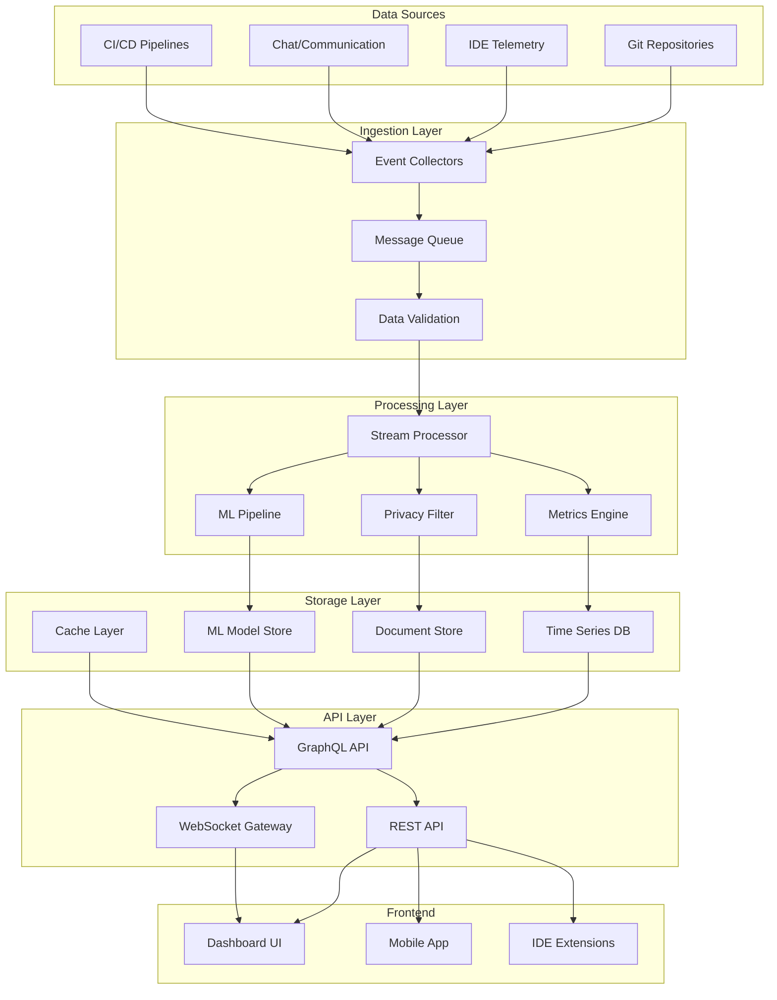
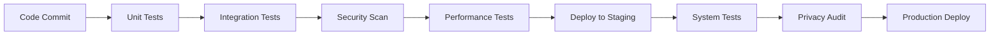

# Design Document

## Overview

DevFlow Intelligence is designed as a microservices-based, AI-powered developer productivity platform that ingests real-time development data, processes it through machine learning pipelines, and delivers personalized insights through adaptive dashboards. The system follows an event-driven architecture to handle high-volume data streams while maintaining privacy and security as core design principles.

## Architecture

### High-Level Architecture



### Technology Stack

- **Data Ingestion**: Apache Kafka, Apache Pulsar for event streaming
- **Stream Processing**: Apache Flink, Apache Storm for real-time processing
- **Machine Learning**: TensorFlow, PyTorch for ML models, MLflow for model management
- **Storage**: InfluxDB for time series, MongoDB for documents, Redis for caching
- **API**: GraphQL with Apollo Server, REST with Express.js
- **Frontend**: React with TypeScript, D3.js for visualizations
- **Infrastructure**: Kubernetes, Docker, Prometheus for monitoring

## Components and Interfaces

### Data Ingestion Service

**Purpose**: Collect and normalize data from multiple development sources

**Key Components**:
- Git Event Collector: Webhooks and polling for repository events
- IDE Telemetry Collector: Plugin-based data collection with privacy controls
- Communication Ingester: API integrations with Slack, Teams, Discord
- Event Normalizer: Standardizes data formats across sources

**Interfaces**:
```typescript
interface EventCollector {
  collect(source: DataSource): Promise<RawEvent[]>
  validate(event: RawEvent): ValidationResult
  transform(event: RawEvent): NormalizedEvent
}

interface DataSource {
  type: 'git' | 'ide' | 'communication' | 'cicd'
  config: SourceConfiguration
  credentials: EncryptedCredentials
}
```

### Stream Processing Engine

**Purpose**: Real-time processing of development events with ML-powered analysis

**Key Components**:
- Event Router: Directs events to appropriate processing pipelines
- Metrics Calculator: Computes productivity metrics in real-time
- Anomaly Detector: ML-based detection of productivity patterns
- Privacy Enforcer: Applies privacy rules and data anonymization

**Interfaces**:
```typescript
interface StreamProcessor {
  process(event: NormalizedEvent): Promise<ProcessedMetric[]>
  detectAnomalies(metrics: Metric[]): AnomalyResult[]
  applyPrivacyRules(data: any, userId: string): FilteredData
}

interface Metric {
  type: MetricType
  value: number
  timestamp: Date
  userId: string
  metadata: Record<string, any>
}
```

### Machine Learning Pipeline

**Purpose**: Generate insights and predictions from processed development data

**Key Components**:
- Feature Engineering: Extracts ML features from raw metrics
- Model Training: Automated retraining of productivity models
- Inference Engine: Real-time prediction and recommendation generation
- Model Registry: Versioned storage and deployment of ML models

**Interfaces**:
```typescript
interface MLPipeline {
  extractFeatures(metrics: Metric[]): FeatureVector
  predict(features: FeatureVector, modelId: string): Prediction
  train(dataset: TrainingData): ModelVersion
  evaluate(model: ModelVersion, testData: TestData): EvaluationMetrics
}

interface Prediction {
  type: 'productivity_forecast' | 'quality_risk' | 'bottleneck_detection'
  confidence: number
  value: any
  recommendations: Recommendation[]
}
```

### Dashboard Service

**Purpose**: Adaptive, role-based dashboard generation with real-time updates

**Key Components**:
- Widget Engine: Dynamic widget creation and configuration
- Personalization Engine: AI-driven dashboard customization
- Real-time Updates: WebSocket-based live data streaming
- Export Service: Report generation and sharing capabilities

**Interfaces**:
```typescript
interface DashboardService {
  generateDashboard(userId: string, context: WorkContext): Dashboard
  updateWidget(widgetId: string, config: WidgetConfig): Widget
  subscribeToUpdates(dashboardId: string): EventStream
  exportReport(dashboardId: string, format: ExportFormat): Report
}

interface Widget {
  id: string
  type: WidgetType
  config: WidgetConfig
  data: WidgetData
  permissions: Permission[]
}
```

### Alert and Notification Service

**Purpose**: Intelligent alerting with context-aware notifications

**Key Components**:
- Alert Engine: Rule-based and ML-powered alert generation
- Notification Router: Multi-channel notification delivery
- Escalation Manager: Automated escalation based on severity
- Feedback Loop: Learning from user responses to improve alerting

**Interfaces**:
```typescript
interface AlertService {
  evaluateRules(metrics: Metric[]): Alert[]
  sendNotification(alert: Alert, channels: NotificationChannel[]): void
  escalate(alert: Alert, escalationPolicy: EscalationPolicy): void
  recordFeedback(alertId: string, feedback: AlertFeedback): void
}

interface Alert {
  id: string
  severity: AlertSeverity
  type: AlertType
  message: string
  context: AlertContext
  recommendations: Recommendation[]
}
```

## Data Models

### Core Data Models

```typescript
// User and Team Models
interface User {
  id: string
  email: string
  name: string
  role: UserRole
  teamIds: string[]
  privacySettings: PrivacySettings
  preferences: UserPreferences
}

interface Team {
  id: string
  name: string
  memberIds: string[]
  projectIds: string[]
  settings: TeamSettings
}

// Development Activity Models
interface GitEvent {
  id: string
  type: 'commit' | 'push' | 'pull_request' | 'merge'
  repository: string
  author: string
  timestamp: Date
  metadata: GitEventMetadata
}

interface IDETelemetry {
  id: string
  userId: string
  sessionId: string
  eventType: 'keystroke' | 'file_change' | 'debug' | 'focus'
  timestamp: Date
  data: TelemetryData
  privacyLevel: PrivacyLevel
}

// Metrics and Analytics Models
interface ProductivityMetric {
  id: string
  userId: string
  metricType: MetricType
  value: number
  timestamp: Date
  aggregationPeriod: TimePeriod
  context: MetricContext
}

interface FlowState {
  userId: string
  sessionId: string
  startTime: Date
  endTime?: Date
  interruptionCount: number
  focusScore: number
  activities: Activity[]
}

// ML and Insights Models
interface InsightModel {
  id: string
  version: string
  type: ModelType
  accuracy: number
  trainingData: TrainingMetadata
  deploymentStatus: DeploymentStatus
}

interface Recommendation {
  id: string
  userId: string
  type: RecommendationType
  priority: Priority
  message: string
  actionItems: ActionItem[]
  expiresAt: Date
}
```

### Privacy and Security Models

```typescript
interface PrivacySettings {
  userId: string
  dataCollection: DataCollectionSettings
  sharing: SharingSettings
  retention: RetentionSettings
  anonymization: AnonymizationLevel
}

interface DataCollectionSettings {
  ideTelemtry: boolean
  gitActivity: boolean
  communicationData: boolean
  granularControls: Record<string, boolean>
}

interface EncryptedData {
  encryptedValue: string
  encryptionMethod: string
  keyId: string
  metadata: EncryptionMetadata
}
```

## Error Handling

### Error Categories and Strategies

**Data Ingestion Errors**:
- Network failures: Exponential backoff with circuit breaker pattern
- Malformed data: Validation with graceful degradation
- Rate limiting: Adaptive throttling with priority queuing
- Authentication failures: Automatic token refresh with fallback

**Processing Errors**:
- ML model failures: Fallback to rule-based systems
- Resource exhaustion: Auto-scaling with load shedding
- Data corruption: Checksums with automatic recovery
- Timeout errors: Async processing with result caching

**Privacy Violations**:
- Unauthorized access: Immediate data access revocation
- Data leakage: Automatic anonymization with audit trails
- Consent violations: Data deletion with compliance reporting
- Breach detection: Incident response with stakeholder notification

### Error Recovery Mechanisms

```typescript
interface ErrorHandler {
  handleIngestionError(error: IngestionError): RecoveryAction
  handleProcessingError(error: ProcessingError): RecoveryAction
  handlePrivacyError(error: PrivacyError): RecoveryAction
  reportError(error: SystemError): void
}

interface RecoveryAction {
  type: 'retry' | 'fallback' | 'escalate' | 'ignore'
  delay?: number
  maxAttempts?: number
  fallbackStrategy?: FallbackStrategy
}
```

## Testing Strategy

### Testing Pyramid

**Unit Tests (70%)**:
- Individual component testing with mocked dependencies
- ML model validation with synthetic datasets
- Privacy rule enforcement testing
- API endpoint testing with various input scenarios

**Integration Tests (20%)**:
- End-to-end data flow testing from ingestion to dashboard
- Cross-service communication testing
- Database integration testing with real data scenarios
- Authentication and authorization flow testing

**System Tests (10%)**:
- Performance testing under high load conditions
- Security penetration testing
- Privacy compliance validation
- Disaster recovery testing

### Testing Tools and Frameworks

- **Unit Testing**: Jest for JavaScript/TypeScript, pytest for Python
- **Integration Testing**: Testcontainers for database testing, WireMock for API mocking
- **Performance Testing**: K6 for load testing, JMeter for stress testing
- **Security Testing**: OWASP ZAP for vulnerability scanning
- **ML Testing**: Great Expectations for data validation, MLflow for model testing

### Continuous Testing Pipeline



### Test Data Management

- **Synthetic Data Generation**: Automated generation of realistic development data
- **Data Anonymization**: Production data anonymization for testing environments
- **Privacy-Safe Testing**: Ensuring test data doesn't contain real user information
- **Test Data Lifecycle**: Automated cleanup and refresh of test datasets