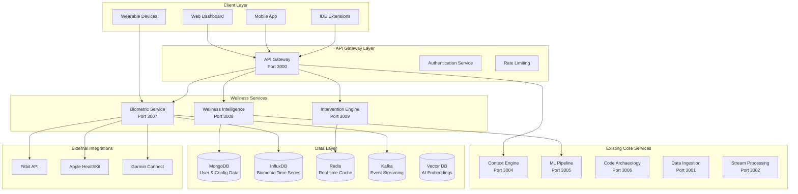

# Developer Wellness Platform - Design Document

## Overview

The Developer Wellness Platform transforms DevFlow into a comprehensive wellness-focused productivity platform that combines biometric monitoring and AI-powered wellness intelligence. This design leverages DevFlow's existing microservices architecture while introducing new wellness-specific services and capabilities.

The platform addresses the market opportunity identified in the analysis by creating a defensible niche in developer wellness, positioning DevFlow as the premier solution for organizations prioritizing sustainable developer productivity over pure output metrics.

## Architecture

### High-Level Architecture



### Service Integration Strategy

The wellness platform integrates with existing DevFlow services through:

1. **Context Engine Enhancement**: Extends existing context awareness with biometric data
2. **ML Pipeline Extension**: Adds wellness prediction models to existing ML infrastructure
3. **Data Ingestion Expansion**: Incorporates biometric data streams into existing ingestion pipeline
4. **Dashboard Enhancement**: Adds wellness widgets to existing dashboard

## Components and Interfaces

### 1. Biometric Service (Port 3007)

**Purpose**: Collects, processes, and stores biometric data from various sources

**Key Components**:
- **Device Integration Manager**: Handles connections to wearable devices
- **Data Validation Engine**: Ensures biometric data quality and accuracy
- **Privacy Filter**: Applies anonymization and consent management
- **Real-time Processor**: Processes biometric streams for immediate insights

**API Interface**:
```typescript
interface BiometricService {
  // Device Management
  connectDevice(userId: string, deviceType: DeviceType, credentials: DeviceCredentials): Promise<ConnectionResult>
  disconnectDevice(userId: string, deviceId: string): Promise<void>
  getConnectedDevices(userId: string): Promise<ConnectedDevice[]>
  
  // Data Collection
  collectBiometricData(userId: string, timeRange: TimeRange): Promise<BiometricData[]>
  streamBiometricData(userId: string): Observable<BiometricReading>
  
  // Health Metrics
  calculateStressLevel(userId: string): Promise<StressMetrics>
  detectFatigue(userId: string): Promise<FatigueIndicators>
  assessWellnessScore(userId: string): Promise<WellnessScore>
}

interface BiometricReading {
  userId: string
  timestamp: Date
  heartRate?: number
  stressLevel?: number
  activityLevel?: number
  sleepQuality?: number
  deviceId: string
  confidence: number
}
```

### 2. Wellness Intelligence Service (Port 3008)

**Purpose**: AI-powered wellness analysis and prediction engine

**Key Components**:
- **Wellness Predictor**: ML models for burnout risk and wellness forecasting
- **Pattern Analyzer**: Identifies wellness patterns and correlations
- **Recommendation Engine**: Generates personalized wellness suggestions
- **Compliance Monitor**: Ensures wellness data handling meets regulations

**API Interface**:
```typescript
interface WellnessIntelligence {
  // Predictive Analytics
  predictBurnoutRisk(userId: string): Promise<BurnoutRiskAssessment>
  forecastWellnessTrends(teamId: string, timeHorizon: number): Promise<WellnessForecast>
  
  // Pattern Analysis
  analyzeWellnessPatterns(userId: string): Promise<WellnessPatterns>
  correlateProductivityWellness(userId: string): Promise<CorrelationAnalysis>
  
  // Recommendations
  generateWellnessRecommendations(userId: string): Promise<WellnessRecommendation[]>
  personalizeInterventions(userId: string, preferences: UserPreferences): Promise<PersonalizedPlan>
}

interface BurnoutRiskAssessment {
  riskLevel: 'LOW' | 'MEDIUM' | 'HIGH' | 'CRITICAL'
  confidence: number
  contributingFactors: string[]
  recommendedActions: string[]
  timeToIntervention: number // hours
}
```

### 3. Intervention Engine (Port 3009)

**Purpose**: Delivers personalized wellness interventions and tracks effectiveness

**Key Components**:
- **Intervention Scheduler**: Times interventions based on user state and preferences
- **Delivery Manager**: Handles multi-modal intervention delivery
- **Effectiveness Tracker**: Measures intervention success and adapts strategies
- **Emergency Handler**: Manages critical wellness situations

**API Interface**:
```typescript
interface InterventionEngine {
  // Intervention Management
  scheduleIntervention(userId: string, intervention: InterventionPlan): Promise<void>
  deliverIntervention(userId: string, interventionId: string): Promise<DeliveryResult>
  cancelIntervention(userId: string, interventionId: string): Promise<void>
  
  // Effectiveness Tracking
  trackInterventionEffectiveness(userId: string, interventionId: string, outcome: InterventionOutcome): Promise<void>
  getInterventionHistory(userId: string): Promise<InterventionHistory[]>
  
  // Emergency Response
  triggerEmergencyIntervention(userId: string, severity: EmergencySeverity): Promise<EmergencyResponse>
}

interface InterventionPlan {
  type: 'BREAK_REMINDER' | 'STRESS_REDUCTION' | 'MOVEMENT_PROMPT' | 'HYDRATION_REMINDER'
  deliveryMethod: 'VISUAL' | 'AUDIO' | 'HAPTIC' | 'MULTI_MODAL'
  timing: InterventionTiming
  personalization: PersonalizationSettings
  duration: number
}
```


## Data Models

### Biometric Data Model

```typescript
interface BiometricProfile {
  userId: string
  connectedDevices: ConnectedDevice[]
  baselineMetrics: BaselineMetrics
  privacySettings: BiometricPrivacySettings
  medicalConsiderations?: MedicalConsiderations
  createdAt: Date
  updatedAt: Date
}

interface ConnectedDevice {
  deviceId: string
  deviceType: 'APPLE_WATCH' | 'FITBIT' | 'GARMIN' | 'CUSTOM'
  connectionStatus: 'CONNECTED' | 'DISCONNECTED' | 'ERROR'
  lastSync: Date
  dataTypes: BiometricDataType[]
  batteryLevel?: number
}

interface BaselineMetrics {
  restingHeartRate: number
  maxHeartRate: number
  stressThreshold: number
  fatigueIndicators: FatigueBaseline
  sleepPattern: SleepBaseline
  activityLevel: ActivityBaseline
}

interface BiometricReading {
  id: string
  userId: string
  deviceId: string
  timestamp: Date
  heartRate?: HeartRateReading
  stress?: StressReading
  activity?: ActivityReading
  sleep?: SleepReading
  environment?: EnvironmentReading
  quality: DataQuality
}
```

### Wellness Intelligence Model

```typescript
interface WellnessProfile {
  userId: string
  wellnessGoals: WellnessGoal[]
  riskFactors: RiskFactor[]
  interventionPreferences: InterventionPreferences
  wellnessHistory: WellnessSnapshot[]
  complianceSettings: ComplianceSettings
  createdAt: Date
  updatedAt: Date
}

interface WellnessSnapshot {
  timestamp: Date
  overallScore: number // 0-100
  dimensions: {
    physical: number
    mental: number
    emotional: number
    social: number
    productivity: number
  }
  riskIndicators: RiskIndicator[]
  interventionsActive: string[]
}

interface WellnessRecommendation {
  id: string
  userId: string
  type: RecommendationType
  priority: 'LOW' | 'MEDIUM' | 'HIGH' | 'URGENT'
  title: string
  description: string
  actionItems: ActionItem[]
  expectedOutcome: string
  timeframe: number // minutes
  evidenceBased: boolean
  personalizationScore: number
}
```


## Error Handling

### Biometric Data Error Handling

1. **Device Connection Failures**:
   - Automatic retry with exponential backoff
   - Fallback to alternative data sources
   - User notification with troubleshooting steps
   - Graceful degradation of wellness features

2. **Data Quality Issues**:
   - Real-time data validation and filtering
   - Confidence scoring for all biometric readings
   - Outlier detection and correction
   - Missing data interpolation using ML models

3. **Privacy Violations**:
   - Immediate data collection halt
   - Automatic privacy officer notification
   - Audit trail generation
   - User consent re-verification

## Testing Strategy

### Unit Testing

**Biometric Service Testing**:
- Mock device integrations for consistent testing
- Biometric data validation logic verification
- Privacy filter effectiveness testing
- Real-time processing performance testing

**Wellness Intelligence Testing**:
- ML model accuracy validation with test datasets
- Prediction confidence interval testing
- Recommendation relevance scoring
- Compliance rule enforcement testing

### Integration Testing

**Cross-Service Integration**:
- Biometric data flow through wellness intelligence
- Context engine integration with existing services
- ML pipeline integration with wellness predictions
- Real-time data synchronization testing

**External API Integration**:
- Wearable device API reliability testing
- Health platform data synchronization
- Third-party service failover testing
- Rate limiting and quota management testing

### End-to-End Testing

**Wellness Workflow Testing**:
- Complete biometric monitoring to intervention delivery
- Multi-modal command execution workflows
- Emergency intervention trigger and response
- Compliance audit trail generation

**Performance Testing**:
- Real-time biometric data processing under load
- Wellness prediction accuracy under various data conditions
- System scalability with multiple concurrent users

### Accessibility Testing

**Wellness Feature Accessibility**:
- Alternative biometric data input methods
- Accessible wellness dashboard design
- Intervention delivery accessibility options
- Compliance with WCAG 2.1 AA standards

**Wellness Feature Accessibility**:
- Alternative biometric data input methods
- Accessible wellness dashboard design
- Intervention delivery accessibility options
- Compliance with WCAG 2.1 AA standards

## Security and Privacy Considerations

### Biometric Data Security

1. **Data Encryption**:
   - AES-256 encryption for biometric data at rest
   - TLS 1.3 for data in transit
   - End-to-end encryption for device communications
   - Encrypted backup and disaster recovery

2. **Access Control**:
   - Role-based access to biometric data
   - Multi-factor authentication for sensitive operations
   - Audit logging for all biometric data access
   - Time-limited access tokens

3. **Privacy Compliance**:
   - HIPAA compliance for health data handling
   - GDPR compliance for EU users
   - Granular consent management
   - Right to deletion implementation

## Performance Requirements

### Real-Time Processing

- **Biometric Data Processing**: <100ms latency for real-time wellness alerts
- **Wellness Prediction**: <2s response time for burnout risk assessment

### Scalability

- **Concurrent Users**: Support 10,000+ simultaneous biometric monitoring sessions
- **Data Throughput**: Process 1M+ biometric readings per minute
- **Storage Scaling**: Auto-scaling for time-series biometric data storage
- **ML Model Serving**: <150ms inference time for wellness predictions

### Availability

- **Service Uptime**: 99.9% availability for wellness monitoring services
- **Data Backup**: Real-time replication with <5 minute RPO
- **Disaster Recovery**: <30 minute RTO for wellness service restoration
- **Graceful Degradation**: Maintain core functionality during partial service outages