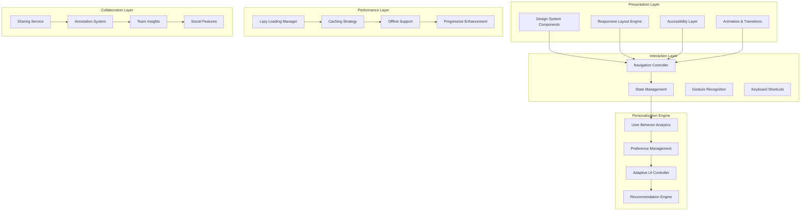

# Design Document

## Overview

The User Experience Improvements design focuses on creating a cohesive, accessible, and delightful user experience for the DevFlow Intelligence dashboard. The design emphasizes progressive disclosure, consistent interaction patterns, and adaptive interfaces that learn from user behavior. The solution integrates modern UX principles with performance optimization to create a dashboard that feels fast, intuitive, and personally relevant to each user.

## Architecture

### UX Architecture Overview



### Technology Stack

- **Frontend Framework**: React 18 with Concurrent Features, TypeScript
- **State Management**: Zustand with persistence and middleware
- **Design System**: Radix UI primitives with custom design tokens
- **Styling**: Tailwind CSS with CSS-in-JS for dynamic theming
- **Animation**: Framer Motion for smooth transitions and micro-interactions
- **Charts**: D3.js with React integration, Observable Plot for advanced visualizations
- **Accessibility**: React Aria, axe-core for automated testing
- **Performance**: React Query for data fetching, Virtual scrolling for large lists
- **Mobile**: PWA capabilities, touch gesture libraries
- **Testing**: React Testing Library, Playwright for E2E, Storybook for component development

## Components and Interfaces

### Design System Foundation

**Purpose**: Consistent, accessible, and themeable UI components

**Key Components**:
- Token System: Design tokens for colors, typography, spacing, and motion
- Component Library: Reusable components with built-in accessibility
- Theme Engine: Dynamic theming with user preferences and system detection
- Icon System: Consistent iconography with semantic meaning

**Interfaces**:
```typescript
interface DesignSystem {
  tokens: DesignTokens
  components: ComponentLibrary
  themes: ThemeConfiguration[]
  accessibility: AccessibilityConfig
}

interface DesignTokens {
  colors: ColorPalette
  typography: TypographyScale
  spacing: SpacingScale
  motion: MotionTokens
  breakpoints: ResponsiveBreakpoints
}

interface ComponentLibrary {
  Button: ComponentDefinition
  Card: ComponentDefinition
  Chart: ComponentDefinition
  Navigation: ComponentDefinition
  // ... other components
}

interface AccessibilityConfig {
  colorContrast: ContrastRatios
  focusManagement: FocusConfig
  screenReader: ScreenReaderConfig
  keyboardNavigation: KeyboardConfig
}
```

### Navigation and Information Architecture

**Purpose**: Intuitive navigation with clear information hierarchy

**Key Components**:
- Adaptive Navigation: Context-aware navigation that changes based on user role and current task
- Breadcrumb System: Clear path indication with clickable navigation history
- Global Search: Intelligent search with autocomplete and contextual results
- Quick Actions: Keyboard shortcuts and command palette for power users

**Interfaces**:
```typescript
interface NavigationController {
  getCurrentContext(): NavigationContext
  navigateTo(route: Route, options?: NavigationOptions): void
  updateBreadcrumbs(path: BreadcrumbItem[]): void
  registerShortcut(shortcut: KeyboardShortcut): void
}

interface NavigationContext {
  currentRoute: Route
  userRole: UserRole
  availableActions: Action[]
  breadcrumbs: BreadcrumbItem[]
}

interface GlobalSearch {
  search(query: string): Promise<SearchResult[]>
  getSuggestions(partial: string): Promise<Suggestion[]>
  registerSearchProvider(provider: SearchProvider): void
}
```

### Personalization and Adaptive UI

**Purpose**: Learn from user behavior to provide personalized experiences

**Key Components**:
- Behavior Tracker: Non-intrusive tracking of user interactions and preferences
- Adaptive Layout: Dynamic layout adjustment based on usage patterns
- Smart Defaults: Context-aware default settings for new users
- Preference Sync: Cross-device synchronization of user preferences

**Interfaces**:
```typescript
interface PersonalizationEngine {
  trackUserBehavior(event: UserInteractionEvent): void
  getPersonalizedLayout(userId: string): Promise<LayoutConfiguration>
  suggestWidgets(context: UserContext): Promise<WidgetSuggestion[]>
  syncPreferences(userId: string, device: DeviceInfo): Promise<void>
}

interface UserInteractionEvent {
  type: InteractionType
  element: string
  timestamp: Date
  context: InteractionContext
  duration?: number
}

interface LayoutConfiguration {
  widgets: WidgetPlacement[]
  theme: ThemePreference
  density: LayoutDensity
  customizations: LayoutCustomization[]
}
```

### Performance and Loading States

**Purpose**: Fast, responsive interactions with graceful loading

**Key Components**:
- Skeleton Loading: Content-aware skeleton screens during data loading
- Progressive Enhancement: Core functionality first, enhanced features loaded progressively
- Lazy Loading: Component and route-based lazy loading with preloading strategies
- Offline Support: Service worker with intelligent caching and sync

**Interfaces**:
```typescript
interface PerformanceManager {
  preloadRoute(route: Route): Promise<void>
  getCachedData(key: string): Promise<CachedData | null>
  scheduleBackgroundSync(task: SyncTask): void
  measurePerformance(metric: PerformanceMetric): void
}

interface LoadingStateManager {
  showSkeleton(component: ComponentType): void
  updateLoadingProgress(progress: number): void
  handleError(error: LoadingError): void
  retryFailedLoad(component: ComponentType): Promise<void>
}

interface OfflineManager {
  isOnline(): boolean
  queueAction(action: OfflineAction): void
  syncWhenOnline(): Promise<SyncResult>
  getCachedContent(key: string): Promise<Content | null>
}
```

### Accessibility and Inclusive Design

**Purpose**: Ensure all users can effectively use the dashboard

**Key Components**:
- Focus Management: Intelligent focus handling for complex interactions
- Screen Reader Support: Comprehensive ARIA labels and live regions
- Keyboard Navigation: Full keyboard accessibility with logical tab order
- Visual Accessibility: High contrast modes, reduced motion, and customizable fonts

**Interfaces**:
```typescript
interface AccessibilityManager {
  manageFocus(element: HTMLElement, options?: FocusOptions): void
  announceToScreenReader(message: string, priority: Priority): void
  updateLiveRegion(content: string, region: LiveRegion): void
  checkContrast(foreground: Color, background: Color): ContrastResult
}

interface KeyboardNavigationManager {
  registerShortcut(shortcut: KeyboardShortcut, handler: ShortcutHandler): void
  setTabOrder(elements: HTMLElement[]): void
  trapFocus(container: HTMLElement): FocusTrap
  handleArrowNavigation(direction: Direction, context: NavigationContext): void
}

interface VisualAccessibilityManager {
  applyHighContrast(enabled: boolean): void
  setFontSize(scale: FontScale): void
  enableReducedMotion(enabled: boolean): void
  updateColorBlindnessFilter(type: ColorBlindnessType): void
}
```

### Data Visualization Enhancement

**Purpose**: Clear, interactive, and accessible data visualizations

**Key Components**:
- Chart Factory: Intelligent chart type selection based on data characteristics
- Interactive Controls: Zoom, pan, brush, and drill-down capabilities
- Accessibility Layer: Alternative text, data tables, and keyboard navigation for charts
- Export System: High-quality exports with customizable formatting

**Interfaces**:
```typescript
interface ChartFactory {
  createChart(data: ChartData, config: ChartConfig): Chart
  suggestChartType(data: ChartData): ChartType[]
  optimizeForMobile(chart: Chart): Chart
  addInteractivity(chart: Chart, interactions: Interaction[]): Chart
}

interface ChartAccessibility {
  generateAltText(chart: Chart): string
  createDataTable(chart: Chart): DataTable
  addKeyboardNavigation(chart: Chart): void
  announceDataChanges(chart: Chart, changes: DataChange[]): void
}

interface ChartInteraction {
  enableZoom(chart: Chart, config: ZoomConfig): void
  enableBrushing(chart: Chart, callback: BrushCallback): void
  addTooltips(chart: Chart, formatter: TooltipFormatter): void
  linkCharts(charts: Chart[], linkType: LinkType): void
}
```

### Mobile Optimization

**Purpose**: Optimized mobile experience with touch-friendly interactions

**Key Components**:
- Responsive Layout: Adaptive layouts that work across all screen sizes
- Touch Gestures: Swipe, pinch, and tap gestures for natural mobile interaction
- Mobile Navigation: Collapsible navigation with bottom tab bars
- Offline Sync: Robust offline support with background synchronization

**Interfaces**:
```typescript
interface MobileOptimizer {
  adaptLayoutForScreen(layout: Layout, screenSize: ScreenSize): Layout
  enableTouchGestures(element: HTMLElement, gestures: GestureConfig[]): void
  optimizeChartsForMobile(chart: Chart): Chart
  handleOrientationChange(orientation: Orientation): void
}

interface TouchGestureManager {
  registerSwipeHandler(element: HTMLElement, handler: SwipeHandler): void
  enablePinchZoom(element: HTMLElement, config: PinchConfig): void
  addTapGesture(element: HTMLElement, handler: TapHandler): void
  preventScrollBounce(element: HTMLElement): void
}

interface MobileNavigation {
  showBottomTabs(tabs: TabConfig[]): void
  enableHamburgerMenu(menu: MenuConfig): void
  addFloatingActionButton(action: ActionConfig): void
  handleBackButton(handler: BackButtonHandler): void
}
```

### Collaboration and Social Features

**Purpose**: Enable team collaboration and knowledge sharing

**Key Components**:
- Sharing System: Easy sharing of dashboards, insights, and annotations
- Annotation Engine: Collaborative annotations on charts and dashboards
- Team Insights: Aggregated team performance with privacy protection
- Achievement System: Gamification elements to encourage engagement

**Interfaces**:
```typescript
interface CollaborationManager {
  shareContent(content: ShareableContent, recipients: User[]): Promise<ShareResult>
  createAnnotation(target: AnnotationTarget, content: string): Promise<Annotation>
  getTeamInsights(teamId: string, privacy: PrivacyLevel): Promise<TeamInsights>
  celebrateAchievement(achievement: Achievement, user: User): void
}

interface AnnotationSystem {
  addAnnotation(annotation: Annotation): Promise<void>
  getAnnotations(target: AnnotationTarget): Promise<Annotation[]>
  updateAnnotation(id: string, content: string): Promise<void>
  deleteAnnotation(id: string): Promise<void>
}

interface SocialFeatures {
  showAchievements(userId: string): Promise<Achievement[]>
  suggestBestPractices(context: UserContext): Promise<BestPractice[]>
  enableTeamChallenges(team: Team): Promise<Challenge[]>
  shareSuccess(success: SuccessStory): Promise<void>
}
```

## Data Models

### User Experience Models

```typescript
// User Preferences and Personalization
interface UserPreferences {
  id: string
  userId: string
  theme: ThemePreference
  layout: LayoutPreference
  accessibility: AccessibilityPreferences
  notifications: NotificationPreferences
  privacy: PrivacyPreferences
  lastUpdated: Date
}

interface ThemePreference {
  mode: 'light' | 'dark' | 'auto'
  colorScheme: ColorScheme
  density: 'compact' | 'comfortable' | 'spacious'
  customColors?: CustomColorConfig
}

interface AccessibilityPreferences {
  highContrast: boolean
  reducedMotion: boolean
  fontSize: FontScale
  screenReaderOptimized: boolean
  keyboardNavigation: boolean
  colorBlindnessFilter?: ColorBlindnessType
}

// Interaction and Behavior Tracking
interface UserInteraction {
  id: string
  userId: string
  sessionId: string
  type: InteractionType
  element: string
  timestamp: Date
  duration?: number
  context: InteractionContext
  metadata: Record<string, any>
}

interface UserSession {
  id: string
  userId: string
  startTime: Date
  endTime?: Date
  device: DeviceInfo
  interactions: UserInteraction[]
  performance: SessionPerformance
}

// Layout and Customization
interface DashboardLayout {
  id: string
  userId: string
  name: string
  isDefault: boolean
  widgets: WidgetPlacement[]
  customizations: LayoutCustomization[]
  createdAt: Date
  updatedAt: Date
}

interface WidgetPlacement {
  widgetId: string
  position: GridPosition
  size: WidgetSize
  configuration: WidgetConfig
  visibility: VisibilityRule[]
}

// Collaboration Models
interface SharedContent {
  id: string
  type: 'dashboard' | 'chart' | 'insight' | 'annotation'
  contentId: string
  sharedBy: string
  sharedWith: string[]
  permissions: SharePermission[]
  expiresAt?: Date
  createdAt: Date
}

interface Annotation {
  id: string
  authorId: string
  targetType: 'chart' | 'widget' | 'dashboard'
  targetId: string
  position: AnnotationPosition
  content: string
  replies: AnnotationReply[]
  createdAt: Date
  updatedAt: Date
}

// Performance and Analytics
interface PerformanceMetric {
  id: string
  userId?: string
  sessionId: string
  metricType: PerformanceMetricType
  value: number
  timestamp: Date
  context: PerformanceContext
}

interface LoadingState {
  component: string
  state: 'loading' | 'loaded' | 'error' | 'skeleton'
  startTime: Date
  endTime?: Date
  errorMessage?: string
  retryCount: number
}
```

### Mobile and Responsive Models

```typescript
interface DeviceInfo {
  type: 'desktop' | 'tablet' | 'mobile'
  screenSize: ScreenSize
  orientation: 'portrait' | 'landscape'
  touchCapable: boolean
  platform: Platform
  browserInfo: BrowserInfo
}

interface ResponsiveBreakpoint {
  name: string
  minWidth: number
  maxWidth?: number
  columns: number
  gutters: number
  margins: number
}

interface TouchGesture {
  type: GestureType
  element: string
  startPosition: Position
  endPosition: Position
  duration: number
  velocity?: number
  direction?: Direction
}
```

## Error Handling

### UX Error Handling Strategy

**Progressive Error Recovery**:
- Graceful degradation when features fail
- Clear error messages with actionable recovery steps
- Automatic retry mechanisms with exponential backoff
- Fallback content when primary content fails to load

**User-Friendly Error Communication**:
- Plain language error messages without technical jargon
- Visual error indicators with appropriate severity levels
- Contextual help and suggested actions
- Error reporting with user consent

**Performance Error Handling**:
- Timeout handling with retry options
- Network failure recovery with offline mode
- Memory management with graceful cleanup
- Progressive loading with error boundaries

```typescript
interface ErrorHandler {
  handleUIError(error: UIError, context: ErrorContext): ErrorResponse
  handlePerformanceError(error: PerformanceError): RecoveryAction
  handleAccessibilityError(error: A11yError): A11yRecovery
  reportError(error: Error, userConsent: boolean): void
}

interface ErrorResponse {
  message: string
  severity: ErrorSeverity
  actions: ErrorAction[]
  fallbackContent?: ReactNode
  retryable: boolean
}

interface RecoveryAction {
  type: 'retry' | 'fallback' | 'reload' | 'redirect'
  delay?: number
  maxAttempts?: number
  fallbackStrategy?: FallbackStrategy
}
```

## Testing Strategy

### UX Testing Approach

**Usability Testing**:
- User journey testing with real users
- A/B testing for design variations
- Accessibility testing with assistive technologies
- Performance testing across devices and networks

**Automated Testing**:
- Visual regression testing for UI consistency
- Interaction testing with Playwright
- Accessibility testing with axe-core
- Performance testing with Lighthouse CI

**Continuous UX Monitoring**:
- Real user monitoring (RUM) for performance
- User behavior analytics for optimization
- Error tracking and user feedback collection
- Conversion funnel analysis for key workflows

```typescript
interface UXTestingFramework {
  runUsabilityTest(scenario: TestScenario): Promise<UsabilityResult>
  performA11yAudit(component: Component): Promise<A11yAuditResult>
  measurePerformance(page: Page): Promise<PerformanceReport>
  trackUserBehavior(session: UserSession): Promise<BehaviorInsights>
}

interface UsabilityResult {
  taskCompletionRate: number
  averageTaskTime: number
  errorRate: number
  satisfactionScore: number
  issues: UsabilityIssue[]
}
```

### Testing Tools and Metrics

- **Usability Testing**: UserTesting.com, Maze for remote testing
- **A/B Testing**: Optimizely, LaunchDarkly for feature flags
- **Accessibility**: axe-core, WAVE, manual testing with screen readers
- **Performance**: Lighthouse, WebPageTest, Core Web Vitals monitoring
- **Analytics**: Custom analytics with privacy-first approach
- **Visual Testing**: Percy, Chromatic for visual regression
- **User Feedback**: Hotjar, FullStory for session recordings (with consent)

### Success Metrics

**User Experience KPIs**:
- Task completion rate > 95%
- Average task completion time < 30 seconds
- User satisfaction score > 4.5/5
- Accessibility compliance score > 95%
- Page load time < 1 second (P95)
- Error rate < 1%
- User retention rate > 80%
- Feature adoption rate > 60%